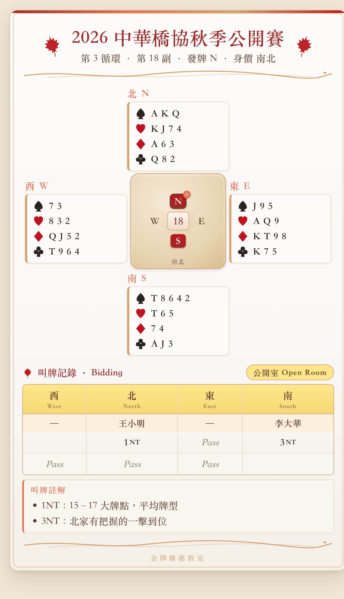

# 🍁 Bridge Diagram Generator — Autumn Maple Edition

**中橋秋季特輯 · 牌圖與叫牌排版工作台**

開放給大眾使用、免登入、即時預覽、一鍵下載 300DPI 級 PNG 的橋牌牌圖與叫牌自動生成系統。
外觀與產出的卡片圖檔皆以「秋風、紅楓葉、羊皮紙」為視覺語彙，追求出版級的編排質感。



## 功能

- **賽事基本資訊**：賽事名稱、副數/場次、發牌編號、發牌者、身價（雙無 / 南北 / 東西 / 雙方）。
- **四家手牌**：♠ ♥ ♦ ♣ 逐門輸入，`--` 代表缺門，自動排序整理。
- **叫牌區**：室別標題、四席選手姓名、多行叫牌序列（`P`=Pass、`X`=Dbl、`XX`=Rdbl）、叫牌註解。
- **即時預覽**：右側同步呈現楓葉秋風美感的牌圖卡片。
- **一鍵匯出**：`html2image` 產生寬 540px、3× 高解析度 PNG，自動裁切留白，
  檔名 `Bridge_Diagram_{timestamp}.png`。

## 秋季楓葉色彩計畫

| 角色 | 色票 |
| --- | --- |
| 楓葉赤紅（主標題 / ♥♦ / 裝飾） | `#9E2A2B` `#BA181B` `#C1121F` |
| 琥珀落葉金（邊框流線 / 高光） | `#D4A373` `#E76F51` |
| 羊皮紙米白（卡片背景） | `#FAF8F5` `#FDFBF7` |
| 楓木金黃（叫牌表頭） | `#FDE68A` + 深褐字 `#5B3A29` |
| 深胡桃炭黑（♠♣） | `#2B231F` |

## 本機執行

```bash
pip install -r requirements.txt
streamlit run app.py
```

匯出 PNG 需要本機安裝 Chrome / Chromium（`html2image` 依賴）。

## 部署到 Streamlit Community Cloud（免費）

1. 將本倉庫推送到 GitHub。
2. 前往 <https://share.streamlit.io> → **New app**，選擇此倉庫、分支與 `app.py`。
3. `requirements.txt` 會自動安裝 Python 套件；`packages.txt` 會安裝 `chromium`
   供 `html2image` 匯出使用。
4. Deploy，即可取得公開、免登入的網址。
